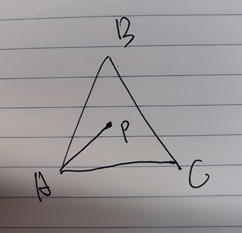

**起因**

1. 重心坐标可以快速判断点是不是在三角形内部，即坐标（u, v, w）满足 u >= 0 && v >= 0 && w >= 0，用于绘制三角形。

2. 重心坐标提供了方便的插值，可以用于

   1. z-buffer：P点的z值可以用A，B，C三个点的z值乘以P点的中心坐标相加得到
      $$
      P_z = u * A_z + v * B_z + w * C_z
      $$

   2. 纹理坐标的插值
   3. 法线的插值

**推导**
$$
w\vec{AP} + u\vec{BP} + v\vec{CP} = 0 & u + v + w = 1\\
(1-u-v)\vec{AP} + u\vec{BP} + v\vec{CP} = 0 \\
(1-u-v)P-(1-u-v)A+uP-uB+vP-vC=0\\
P-uP-vP-A+uA+vA+uP-uB+vP-vC=0\\
P-A+uA+vA-uB-vC=0\\
P=(1-u-v)A+uB+vC\\
所以P的重心坐标是\ (1-u-v,\ u,\ v)\\
$$

$$
P-A+uA+vA-uB-vC=0\\
\vec{AP}+u\vec{BA}+v\vec{CA}=0\\
拆分x和y\\
\left\{
	\begin{array}{**lr**}
	\vec{AP}_x+u\vec{BA}_x+v\vec{CA}_x=0\\
	\vec{AP}_y+u\vec{BA}_y+v\vec{CA}_y=0\\
	\end{array}
\right.\\
变成矩阵\\
\begin{bmatrix}
u & v & 1
\end{bmatrix}
\begin{bmatrix}
\vec{BA}_x\\
\vec{CA}_x\\
\vec{AP}_x\\
\end{bmatrix} = 0
\\
\begin{bmatrix}
u & v & 1
\end{bmatrix}
\begin{bmatrix}
\vec{BA}_y\\
\vec{CA}_y\\
\vec{AP}_y\\
\end{bmatrix} = 0\\
看成向量的话，就是
\begin{bmatrix}
u & v & 1
\end{bmatrix}和另外两个点乘都为0，即同时垂直于两个向量\\
所以\begin{bmatrix}
u & v & 1
\end{bmatrix}是另外两个向量的叉乘
\begin{bmatrix}
u & v & 1
\end{bmatrix} = \begin{bmatrix}
\vec{BA}_x\\
\vec{CA}_x\\
\vec{AP}_x\\
\end{bmatrix} \times
\begin{bmatrix}
\vec{BA}_y\\
\vec{CA}_y\\
\vec{AP}_y\\
\end{bmatrix}
$$

